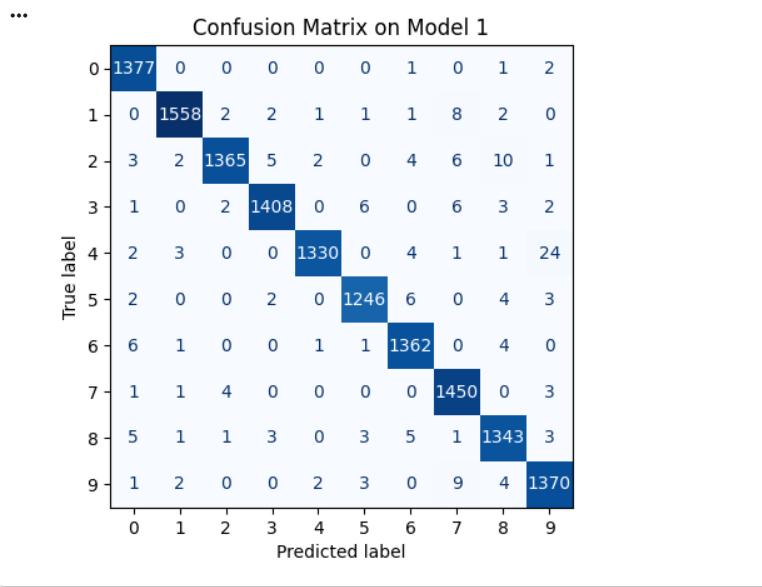
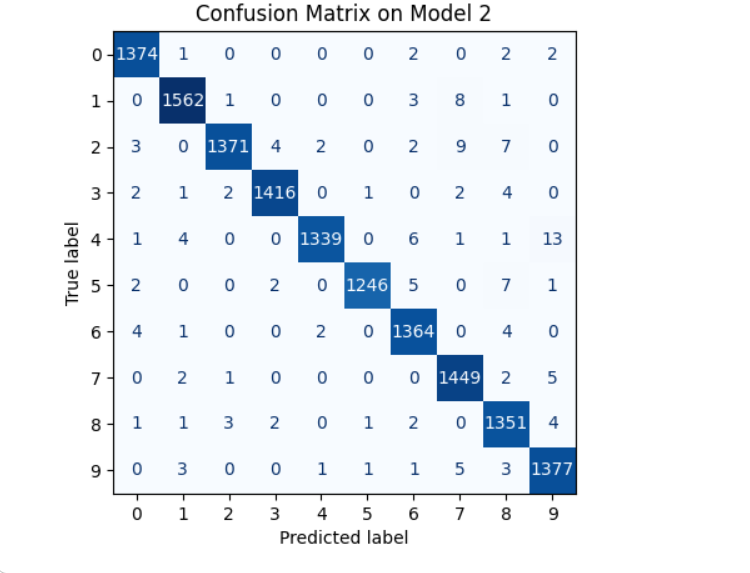
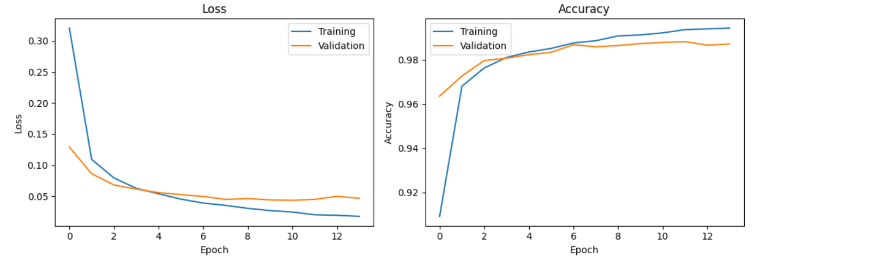

# Where does a CNN make its mistakes?

**Final Project, Option 1 – Machine Learning with Python**

In this project, I built a convolutional neural network that reads handwritten digits. Instead of looking only at its accuracy, I studied which digits it confuses most and tested if one change to the model could reduce those mistakes.

## Problem statement

**Central question:** where does the CNN make its mistakes, and does one change to the model move them?

## Dataset

MNIST (from OpenML): 70,000 greyscale images of handwritten digits (0–9), 28 × 28 pixels. The images were scaled to 0–1 and split 80/20 into training and test sets.

## Method

- **Model 1:** Conv2D(32) → MaxPooling → Dropout(0.3) → Dense(64) → Dense(10)
- **Model 2:** the same, plus a second Conv2D(64) + MaxPooling block (Option A)

Both models were trained with identical settings (Adam, batch size 128, up to 15 epochs, EarlyStopping) and evaluated on the test set with a confusion matrix.

## Results

| | Model 1 | Model 2 |
|---|---|---|
| Test accuracy | 98.6% | 98.9% |
| 4 predicted as 9 | 24 | 13 |
| 2 predicted as 8 | 10 | 7 |

  
  

**Learning curves of Model 1:** both curves improve quickly in the first epochs, while in the later epochs the validation loss stops improving, a sign of mild overfitting.

All outputs are also available in the notebook.

## Interpretation

The first model mostly confused visually similar digits: 4 with 9 and 2 with 8. Adding a second convolutional layer reduced both confusion pairs. The accuracy gain is small and may partly come from training randomness, but the improvement in both specific pairs suggests the deeper network got better at telling these digits apart.

**Limitation:** MNIST was collected mainly from American writers, so the model may be less reliable on other handwriting styles. In a real system, low-confidence predictions should be checked by a human.

## Reflection

**What worked well:** The model reached a high accuracy from the very first attempt.

**What was difficult:** The learning curves showed signs of overfitting in the later epochs, which made me think about how to interpret the results. I was also confused that Model 1 trained for 13 epochs the first time and 14 the second time I ran it,even though the settings were the same.

**What could be improved:** With more time, I would try Option B, raising the Dropout rate from 0.3 to 0.5, to see if stronger regularisation reduces the overfitting I noticed in the learning curves.

## Files

- `cnn_mnist_project.ipynb` – completed notebook with all outputs
- `cnn_mnist_project.pdf` – exported version of the notebook
- `images/` – confusion matrices of both models and the learning curves of Model 1
